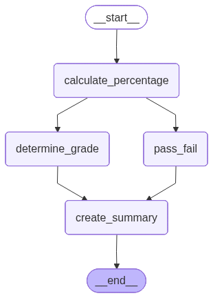
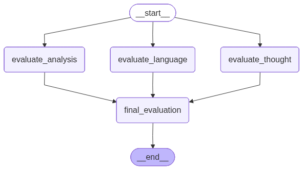
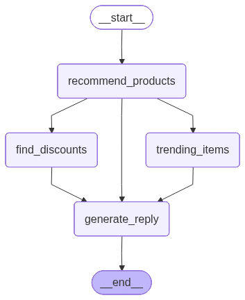

# LangGraph Parallel Workflows: A Beginner's Friendly Guide

## Welcome! 👋

If you've learned about sequential workflows (where things happen one after another) and now want to understand how to make things happen **at the same time**, you're in the right place! This guide will explain parallel workflows in simple terms, using everyday examples and analogies. No prior experience with parallel processing is needed—just a basic understanding of Python and sequential workflows.

## What is a Parallel Workflow?

Think of a parallel workflow like having **multiple workers doing different jobs at the same time** instead of waiting for each other.

**Real-world analogy:** Imagine you're making breakfast:
- **Sequential:** You toast the bread (wait for it), then butter it (wait), then add jam (wait), then serve. Each step waits for the previous one.
- **Parallel:** While the bread is toasting, you can simultaneously boil eggs, brew coffee, and cut fruit. These tasks don't depend on each other, so they can happen at the same time!

**In LangGraph terms:** A parallel workflow lets multiple nodes (work stations) run at the same time when they don't need to wait for each other. This makes your workflow faster and more efficient!

### Why Use Parallel Workflows?

**Speed!** If you have three tasks that each take 10 seconds:
- **Sequential:** 10 + 10 + 10 = 30 seconds total
- **Parallel:** All three run at once = 10 seconds total (3x faster!)

**Efficiency:** When tasks are independent (don't need each other's results), there's no reason to wait!

---

## Table of Contents

1. [What Makes a Workflow Parallel?](#what-makes-a-workflow-parallel)
2. [Understanding Dependencies](#understanding-dependencies)
3. [Building Blocks Review](#building-blocks-review)
4. [Example 1: Student Grade Calculator](#example-1-student-grade-calculator)
5. [Step-by-Step Breakdown](#step-by-step-breakdown)
6. [Example 2: Retail Store Recommendation System](#example-2-retail-store-recommendation-system)
7. [Example 3: Essay Evaluation System](#example-3-essay-evaluation-system)
8. [Visualizing Parallel Workflows](#visualizing-parallel-workflows)
9. [When to Use Parallel vs Sequential](#when-to-use-parallel-vs-sequential)
10. [Common Patterns](#common-patterns)
11. [Tips for Success](#tips-for-success)
12. [What's Next?](#whats-next)

---

## What Makes a Workflow Parallel?

A workflow becomes parallel when **multiple nodes can run at the same time** because they don't depend on each other's results.

### Key Concept: Dependencies

**Dependency** = When one task needs the result from another task before it can start.

**Example:**
- Task A: Calculate total marks
- Task B: Calculate percentage (needs Task A's result) ❌ **Cannot run in parallel**
- Task C: Get student name (doesn't need Task A) ✅ **Can run in parallel with Task A**

### Visual Example

**Sequential Workflow:**
```
[Step 1] → [Step 2] → [Step 3] → [Step 4]
```
Each step waits for the previous one.

**Parallel Workflow:**
```
           [Step 2]
          ↗
[Step 1] → [Step 3] → [Step 4]
          ↘
           [Step 5]
```
Steps 2, 3, and 5 can all run at the same time after Step 1 finishes!

---

## Understanding Dependencies

Before building parallel workflows, you need to understand **what depends on what**.

### How to Identify Dependencies

Ask yourself: **"Does this task need information from that task?"**

**Example 1: Making a Sandwich**
- Task A: Get bread ✅ (no dependencies)
- Task B: Get butter ✅ (no dependencies - can run with Task A)
- Task C: Spread butter on bread ❌ (needs both bread AND butter - must wait)

**Example 2: Student Grade Calculation**
- Task A: Calculate percentage ✅ (needs: total_marks, obtained_marks)
- Task B: Determine grade ❌ (needs: percentage from Task A - must wait)
- Task C: Check pass/fail ❌ (needs: percentage from Task A - must wait)
- Task D: Create summary ❌ (needs: grade from Task B AND pass/fail from Task C - must wait)

**The parallel opportunity:** Tasks B and C can run **at the same time** after Task A finishes, because they both only need the percentage!

---

## Building Blocks Review

If you're familiar with sequential workflows, you already know these! Parallel workflows use the same building blocks:

### 1. State: The Information Container

Same as before! A TypedDict that holds all your information.

```python
from typing import TypedDict

class StudentState(TypedDict):
    name: str
    total_marks: float
    obtained_marks: float
    percentage: float      # Calculated later
    grade: str             # Calculated later
    passed: bool           # Calculated later
    summary: str           # Created at the end
```

### 2. Node Functions: The Workers

Same as before! Functions that process information.

```python
def calculate_percentage(state: StudentState) -> dict:
    """Calculate the percentage score."""
    percentage = (state["obtained_marks"] / state["total_marks"]) * 100
    return {"percentage": round(percentage, 2)}
```

### 3. Graph: The Assembly Line Setup

**The difference:** Instead of connecting nodes one-by-one, you connect multiple nodes to the same starting point or ending point!

```python
from langgraph.graph import StateGraph, START, END

graph = StateGraph(StudentState)

# Add nodes
graph.add_node("calculate_percentage", calculate_percentage)
graph.add_node("determine_grade", determine_grade)
graph.add_node("pass_fail", pass_fail)

# PARALLEL: Both start after calculate_percentage
graph.add_edge(START, "calculate_percentage")
graph.add_edge("calculate_percentage", "determine_grade")  # Branch 1
graph.add_edge("calculate_percentage", "pass_fail")         # Branch 2 (parallel!)
```

**Key insight:** When multiple edges come FROM the same node, those next nodes run in parallel!

---

## Example 1: Student Grade Calculator

Let's build a real example! We'll create a system that calculates a student's grade. This is perfect for parallel workflows because:
- After calculating the percentage, we can determine the grade AND check pass/fail **at the same time**
- Both tasks only need the percentage, so they're independent!

### The Problem We're Solving

You want to process a student's exam results:
1. Calculate their percentage score
2. Determine their letter grade (A+, A, B, C, D)
3. Check if they passed (≥40%)
4. Create a summary report

**The parallel opportunity:** Steps 2 and 3 can happen simultaneously because they both only need the percentage from step 1!

### Step-by-Step Building

#### Step 1: Define What Information We Need (The State)

What information will flow through our workflow?

```python
from typing import TypedDict

class StudentState(TypedDict):
    name: str              # "Abhishek"
    total_marks: float     # 500 (maximum possible)
    obtained_marks: float  # 349 (what the student got)
    percentage: float      # 69.8 (calculated)
    grade: str             # "C" (determined)
    passed: bool           # True (checked)
    summary: str           # Final report (created)
```

**Why these fields?**
- `name`, `total_marks`, `obtained_marks`: Input data (we start with these)
- `percentage`: Calculated in the first step
- `grade`, `passed`: Calculated in parallel after percentage is known
- `summary`: Created at the end using all previous results

#### Step 2: Create the Worker Functions (The Nodes)

Let's create four functions, one for each step:

**Function 1: Calculate Percentage**

This function does the math to find the percentage:

```python
def calculate_percentage(state: StudentState) -> dict:
    """
    This worker calculates the percentage score.
    Formula: (obtained_marks / total_marks) × 100
    """
    # Get the marks from the state
    obtained = state["obtained_marks"]
    total = state["total_marks"]
    
    # Calculate percentage
    percentage = (obtained / total) * 100
    
    # Return the calculated percentage (rounded to 2 decimal places)
    return {"percentage": round(percentage, 2)}
```

**Example:** If a student got 349 out of 500:
- Percentage = (349 / 500) × 100 = 69.8%

**Function 2: Determine Grade**

This function looks at the percentage and assigns a letter grade:

```python
def determine_grade(state: StudentState) -> dict:
    """
    This worker looks at the percentage and assigns a letter grade.
    It only needs the percentage, so it can run in parallel with pass_fail!
    """
    # Get the percentage from the state
    pct = state["percentage"]
    
    # Decide the grade based on percentage ranges
    if pct >= 90:
        grade = "A+"
    elif pct >= 80:
        grade = "A"
    elif pct >= 70:
        grade = "B"
    elif pct >= 60:
        grade = "C"
    else:
        grade = "D"
    
    # Return the grade
    return {"grade": grade}
```

**The grading scale:**
- 90% and above = A+
- 80-89% = A
- 70-79% = B
- 60-69% = C
- Below 60% = D

**Function 3: Check Pass/Fail**

This function determines if the student passed (≥40%):

```python
def pass_fail(state: StudentState) -> dict:
    """
    This worker checks if the student passed (≥40%).
    It only needs the percentage, so it can run in parallel with determine_grade!
    """
    # Get the percentage
    percentage = state["percentage"]
    
    # Check if passed (40% or higher)
    passed = percentage >= 40
    
    # Return the result
    return {"passed": passed}
```

**Key insight:** This function and `determine_grade` both only need the percentage! They don't need each other's results, so they can run **at the same time**!

**Function 4: Create Summary**

This function puts everything together into a nice report:

```python
def create_summary(state: StudentState) -> dict:
    """
    This worker creates a final summary report.
    It needs BOTH the grade AND pass/fail status, so it must wait for both!
    """
    # Get all the information
    name = state["name"]
    percentage = state["percentage"]
    grade = state["grade"]
    passed = state["passed"]
    
    # Create a nice status message
    status = "Passed" if passed else "Failed"
    
    # Build the summary
    summary = (
        f"Student: {name}\n"
        f"Percentage: {percentage}%\n"
        f"Grade: {grade}\n"
        f"Status: {status}"
    )
    
    # Return the summary
    return {"summary": summary}
```

**Important:** This function needs BOTH `grade` and `passed`, so it must wait for both `determine_grade` and `pass_fail` to finish!

#### Step 3: Put It All Together (Build the Graph)

Now comes the exciting part—connecting everything to create parallel execution!

```python
from langgraph.graph import StateGraph, START, END

# Step 1: Create an empty graph
graph = StateGraph(StudentState)

# Step 2: Add all our nodes (the functions that do the work)
graph.add_node("calculate_percentage", calculate_percentage)
graph.add_node("determine_grade", determine_grade)
graph.add_node("pass_fail", pass_fail)
graph.add_node("create_summary", create_summary)

# Step 3: Connect them to create the workflow
# Start by calculating percentage
graph.add_edge(START, "calculate_percentage")

# PARALLEL EXECUTION: Both of these start after calculate_percentage finishes
# They run AT THE SAME TIME because they don't depend on each other!
graph.add_edge("calculate_percentage", "determine_grade")  # Branch 1
graph.add_edge("calculate_percentage", "pass_fail")         # Branch 2 (parallel!)

# After BOTH parallel tasks finish, create the summary
graph.add_edge("determine_grade", "create_summary")
graph.add_edge("pass_fail", "create_summary")

# After summary is created, we're done!
graph.add_edge("create_summary", END)

# Step 4: Compile (make it ready to use)
app = graph.compile()
```

**Visual representation:**



**What's happening here?**

1. **START → calculate_percentage:** First, we calculate the percentage
2. **calculate_percentage → determine_grade:** After percentage is calculated, start determining grade
3. **calculate_percentage → pass_fail:** **AT THE SAME TIME**, start checking pass/fail
4. **determine_grade → create_summary:** After grade is determined, go to summary
5. **pass_fail → create_summary:** After pass/fail is checked, go to summary
6. **create_summary → END:** After summary is created, we're done!

**The magic:** Steps 2 and 3 happen **simultaneously**! LangGraph automatically waits for both to finish before moving to step 4.

#### Step 4: Use It!

Now let's actually use our parallel workflow:

```python
# Give it a student's information
initial_state = {
    "name": "Abhishek",
    "total_marks": 500,
    "obtained_marks": 349,
}

# Run the workflow
response = app.invoke(initial_state)

# Print the final summary
print(response["summary"])
```

**Output:**
```
Student: Abhishek
Percentage: 69.8%
Grade: C
Status: Passed
```

**What happened behind the scenes?**

1. ✅ **calculate_percentage** ran first: Calculated 69.8%
2. ✅ **determine_grade** and **pass_fail** ran **at the same time**:
   - `determine_grade` determined grade = "C"
   - `pass_fail` checked passed = True
3. ✅ **create_summary** ran after both finished: Created the final report

**Time saved:** If each task took 1 second:
- Sequential: 1 + 1 + 1 + 1 = 4 seconds
- Parallel: 1 + 1 (both at once) + 1 = 3 seconds (25% faster!)

---

## Step-by-Step Breakdown

Let's trace through exactly what happens when we run the workflow:

### Initial State
```python
{
    "name": "Abhishek",
    "total_marks": 500,
    "obtained_marks": 349,
    "percentage": 0,      # Not set yet
    "grade": "",          # Not set yet
    "passed": False,      # Not set yet
    "summary": ""         # Not set yet
}
```

### Step 1: Calculate Percentage
**Node:** `calculate_percentage`

**Input state:**
- name: "Abhishek"
- total_marks: 500
- obtained_marks: 349

**What it does:**
- Calculates: (349 / 500) × 100 = 69.8

**Output (updates state):**
```python
{
    "percentage": 69.8  # Added!
}
```

**State after Step 1:**
```python
{
    "name": "Abhishek",
    "total_marks": 500,
    "obtained_marks": 349,
    "percentage": 69.8,  # ✅ Now set!
    "grade": "",
    "passed": False,
    "summary": ""
}
```

### Step 2 & 3: Parallel Execution! 🚀

**Both nodes start at the same time:**

**Node A: `determine_grade`**
- Reads: percentage = 69.8
- Determines: 69.8 is between 60-69, so grade = "C"
- Updates: `{"grade": "C"}`

**Node B: `pass_fail`**
- Reads: percentage = 69.8
- Checks: 69.8 >= 40, so passed = True
- Updates: `{"passed": True}`

**Both finish, state after Step 2 & 3:**
```python
{
    "name": "Abhishek",
    "total_marks": 500,
    "obtained_marks": 349,
    "percentage": 69.8,
    "grade": "C",        # ✅ Now set!
    "passed": True,      # ✅ Now set!
    "summary": ""
}
```

### Step 4: Create Summary
**Node:** `create_summary`

**Input state:**
- Has all information: name, percentage, grade, passed

**What it does:**
- Creates a formatted summary string

**Output (updates state):**
```python
{
    "summary": "Student: Abhishek\nPercentage: 69.8%\nGrade: C\nStatus: Passed"
}
```

**Final state:**
```python
{
    "name": "Abhishek",
    "total_marks": 500,
    "obtained_marks": 349,
    "percentage": 69.8,
    "grade": "C",
    "passed": True,
    "summary": "Student: Abhishek\nPercentage: 69.8%\nGrade: C\nStatus: Passed"  # ✅ Done!
}
```

---

## Example 2: Essay Evaluation System

This example demonstrates a sophisticated parallel workflow where **three different evaluation criteria** are assessed simultaneously. It's perfect for understanding how parallel workflows can make complex analysis tasks much faster.

### The Problem We're Solving

You want to evaluate an essay on three different criteria:
1. **Language quality** (grammar, sentence structure, word choice)
2. **Depth of analysis** (how well the topic is analyzed)
3. **Clarity of thought** (how clear and logical the writing is)

**The parallel opportunity:** All three evaluations can happen **at the same time** because they're independent! They all just need the essay text, and they don't need each other's results.

### Step-by-Step Building

#### Step 1: Set Up the AI with Structured Output

For this example, we'll use an AI that gives us structured (formatted) responses. This ensures we get consistent data:

```python
from langchain_openai import AzureChatOpenAI
from pydantic import BaseModel, Field
from dotenv import load_dotenv
import sys
from pathlib import Path

load_dotenv()

project_root = Path().absolute().parent.parent
sys.path.insert(0, str(project_root))
from tutorial.llm_factory import LLMFactory

# Get the AI ready
llm = LLMFactory().get_llm()

# Define what we want the AI to return (structured format)
class EvaluationSchema(BaseModel):
    feedback: str = Field(description='Detailed feedback for the essay')
    score: int = Field(description='Score out of 10', ge=0, le=10)

# Tell the AI to give us structured output
structured_llm = llm.with_structured_output(EvaluationSchema)
```

**What's `with_structured_output`?** This tells the AI "give me your answer in this exact format" - a feedback string and a score number. This ensures we get consistent, reliable data.

#### Step 2: Define the State

What information will flow through our workflow?

```python
from typing import TypedDict, Annotated
import operator

class TextState(TypedDict):
    text: str                           # The essay to evaluate
    language_feedback: str              # Feedback on language quality
    analysis_feedback: str              # Feedback on depth of analysis
    clarity_feedback: str               # Feedback on clarity of thought
    overall_feedback: str                # Combined feedback
    individual_scores: Annotated[list[int], operator.add]  # List of scores [8, 7, 6]
    avg_score: float                    # Average score (calculated)
```

**Why these fields?**
- `text`: The essay to evaluate (input)
- `language_feedback`, `analysis_feedback`, `clarity_feedback`: Each parallel task fills one
- `individual_scores`: Collects scores from all three evaluations
- `avg_score`: Calculated average
- `overall_feedback`: Final combined feedback

**What's `Annotated[list[int], operator.add]`?** This is a special LangGraph feature that automatically combines lists when multiple nodes update the same field. So if one node adds `[8]` and another adds `[7]`, the final result is `[8, 7]`.

#### Step 3: Create the Worker Functions

**Function 1: Evaluate Language Quality**

This function asks the AI to evaluate the language quality:

```python
def evaluate_language(state: TextState):
    """
    This worker evaluates the language quality of the essay.
    It only needs the text, so it can run in parallel!
    """
    # Create a prompt for the AI
    prompt = f'Evaluate the language quality of the following sentences and provide a feedback and assign a score out of 5 \n {state["text"]}'
    
    # Ask the AI (it will return structured output)
    response = structured_llm.invoke(prompt)
    
    # Return the feedback and score
    return {
        'language_feedback': response.feedback,
        'individual_scores': [response.score]  # Add score to the list
    }
```

**What's happening?** The AI reads the essay and evaluates grammar, sentence structure, and word choice, then gives feedback and a score.

**Function 2: Evaluate Depth of Analysis**

This function asks the AI to evaluate how well the topic is analyzed:

```python
def evaluate_analysis(state: TextState):
    """
    This worker evaluates the depth of analysis in the essay.
    It only needs the text, so it can run in parallel!
    """
    # Create a prompt for the AI
    prompt = f'Evaluate the depth of analysis of the following sentences and provide a feedback and assign a score out of 5 \n {state["text"]}'
    
    # Ask the AI
    response = structured_llm.invoke(prompt)
    
    # Return the feedback and score
    return {
        'analysis_feedback': response.feedback,
        'individual_scores': [response.score]  # Add score to the list
    }
```

**Key insight:** This function is completely independent from `evaluate_language`! They can run at the same time.

**Function 3: Evaluate Clarity of Thought**

This function asks the AI to evaluate how clear and logical the writing is:

```python
def evaluate_thought(state: TextState):
    """
    This worker evaluates the clarity of thought in the essay.
    It only needs the text, so it can run in parallel!
    """
    # Create a prompt for the AI
    prompt = f'Evaluate the clarity of thought of the following sentences and provide a feedback and assign a score out of 5 \n {state["text"]}'
    
    # Ask the AI
    response = structured_llm.invoke(prompt)
    
    # Return the feedback and score
    return {
        'clarity_feedback': response.feedback,
        'individual_scores': [response.score]  # Add score to the list
    }
```

**Parallel opportunity:** All three functions (`evaluate_language`, `evaluate_analysis`, `evaluate_thought`) only need `text` and don't need each other's results. They can all run **simultaneously**!

**Function 4: Final Evaluation**

This function combines all the feedback and calculates the average score:

```python
def final_evaluation(state: TextState):
    """
    This worker creates a summary and calculates the average score.
    It needs ALL three parallel results, so it must wait for them!
    """
    # Get all the feedback from parallel tasks
    language_feedback = state["language_feedback"]
    analysis_feedback = state["analysis_feedback"]
    clarity_feedback = state["clarity_feedback"]
    
    # Create a prompt to summarize all feedback
    prompt = f'Based on the following feedbacks create a summarized feedback \n language feedback - {language_feedback} \n depth of analysis feedback - {analysis_feedback} \n clarity of thought feedback - {clarity_feedback}'
    
    # Ask the AI to create a summary
    overall_feedback = llm.invoke(prompt).content
    
    # Calculate average score
    scores = state['individual_scores']  # This will be [8, 7, 6] for example
    avg_score = sum(scores) / len(scores)
    
    # Return the summary and average
    return {
        'overall_feedback': overall_feedback,
        'avg_score': avg_score
    }
```

**Important:** This function needs results from all three parallel tasks, so it must wait for all of them to finish!

#### Step 4: Build the Graph

Now let's connect everything to create a three-way parallel execution:

```python
from langgraph.graph import StateGraph, START, END

# Create the workflow
graph = StateGraph(TextState)

# Add all our nodes
graph.add_node('evaluate_language', evaluate_language)
graph.add_node('evaluate_analysis', evaluate_analysis)
graph.add_node('evaluate_thought', evaluate_thought)
graph.add_node('final_evaluation', final_evaluation)

# PARALLEL EXECUTION: All three evaluations start from the beginning!
# They all run at the same time because they're independent
graph.add_edge(START, 'evaluate_language')    # Branch 1
graph.add_edge(START, 'evaluate_analysis')    # Branch 2 (parallel!)
graph.add_edge(START, 'evaluate_thought')     # Branch 3 (parallel!)

# After ALL three parallel tasks finish, do the final evaluation
graph.add_edge('evaluate_language', 'final_evaluation')
graph.add_edge('evaluate_analysis', 'final_evaluation')
graph.add_edge('evaluate_thought', 'final_evaluation')

# After final evaluation, we're done!
graph.add_edge('final_evaluation', END)

# Compile it
workflow = graph.compile()
```

**Visual representation:**



**What's happening?**
1. **START → All three evaluations:** `evaluate_language`, `evaluate_analysis`, and `evaluate_thought` all start **at the same time**
2. **All three → final_evaluation:** After all three finish, `final_evaluation` combines everything
3. **final_evaluation → END:** We're done!

**The magic:** All three evaluation tasks run **simultaneously**, making the system 3x faster!

#### Step 5: Use It!

```python
# An essay to evaluate
input_text = """
Geopolitics is very important topic in today world and it affect almost every country. 
It mainly involve big countries who want more power, control and influence. 
Countries like USA, China, Russia and European nations play major role in global politics.
"""

# Run the workflow
initial_state = {
    'text': input_text
}

response = workflow.invoke(initial_state)

# See the results
print("Overall Feedback:")
print(response['overall_feedback'])
print(f"\nAverage Score: {response['avg_score']}/5")
```

**Output:**
```
Overall Feedback:
The essay effectively addresses the topic of geopolitics, presenting relevant examples 
and discussing its implications. However, there are areas for improvement in language 
quality, such as grammar, sentence structure, and word choice...

Average Score: 6.33/5
```

**What happened behind the scenes?**

1. ✅ All three evaluations started **simultaneously**:
   - `evaluate_language` analyzed grammar and language quality
   - `evaluate_analysis` analyzed depth of analysis
   - `evaluate_thought` analyzed clarity of thought
2. ✅ All three finished (they ran in parallel!)
3. ✅ `final_evaluation` combined all feedback and calculated the average score

**Time saved:** If each AI evaluation takes 3 seconds:
- Sequential: 3 + 3 + 3 + 2 = 11 seconds total
- Parallel: 3 (all three at once) + 2 = 5 seconds total (more than 2x faster!)

### What We Learned

- ✅ **Complex analysis tasks benefit from parallelization** (three independent evaluations)
- ✅ **Structured outputs ensure reliable data** (using Pydantic models)
- ✅ **State reducers** (`operator.add`) automatically combine parallel updates
- ✅ **Real-world application** (automated essay grading, content analysis, etc.)
- ✅ **Fan-in pattern with data aggregation** (multiple evaluations feeding into one summary)

---

## Example 3: Retail Store Recommendation System

This example shows a more advanced parallel workflow where **three independent tasks** run simultaneously to provide a complete customer response. It's perfect for understanding how parallel workflows can make customer service systems faster and more efficient.

### The Problem We're Solving

Imagine you run an online store. When a customer asks for product recommendations, you want to provide:
1. Product recommendations
2. Available discounts
3. Trending items

**The parallel opportunity:** All three of these tasks can happen **at the same time** because they're independent! They all just need the customer's message, and they don't need each other's results.

### Step-by-Step Building

#### Step 1: Define the State

What information do we need to carry through our workflow?

```python
from typing import TypedDict, List

class RetailState(TypedDict):
    customer_message: str      # "I want running shoes and a jacket."
    recommendations: List[str]  # ["Nike Air Zoom", "Adidas Ultraboost", ...]
    discounts: List[str]        # ["Seasonal Sales", "Bundle Discounts", ...]
    trending: List[str]         # ["Nike Air Zoom Pegasus 40", ...]
    final_reply: str            # Complete response to customer
```

**Why these fields?**
- `customer_message`: Input from the customer
- `recommendations`, `discounts`, `trending`: Each parallel task fills one of these
- `final_reply`: Final combined response

#### Step 2: Set Up the AI

For this example, we'll use an AI (LLM) to generate recommendations. First, we set it up:

```python
import sys
from pathlib import Path

project_root = Path().absolute().parent.parent
sys.path.insert(0, str(project_root))
from tutorial.llm_factory import LLMFactory

# Get the AI ready
llm = LLMFactory().get_llm()
```

**What's this?** This sets up an AI model that can understand customer requests and generate helpful responses.

#### Step 3: Create the Worker Functions

**Function 1: Recommend Products**

This function asks the AI to suggest products based on the customer's message:

```python
def recommend_products(state: RetailState):
    """
    This worker asks the AI to suggest products.
    It only needs the customer_message, so it can run in parallel!
    """
    # Create a prompt for the AI
    prompt = f"Customer asked: {state['customer_message']}\nSuggest 3 products."
    
    # Ask the AI
    result = llm.invoke(prompt).content
    
    # Split the result into a list (assuming comma-separated)
    return {"recommendations": result.split(", ")}
```

**What's happening?** The AI reads the customer's message and suggests relevant products.

**Function 2: Find Discounts**

This function asks the AI to find available discounts:

```python
def find_discounts(state: RetailState):
    """
    This worker asks the AI to find available discounts.
    It only needs the customer_message, so it can run in parallel!
    """
    # Create a prompt for the AI
    prompt = f"Customer asked: {state['customer_message']}\nSuggest available discounts."
    
    # Ask the AI
    result = llm.invoke(prompt).content
    
    # Split the result into a list
    return {"discounts": result.split(", ")}
```

**Key insight:** This function is completely independent from `recommend_products`! They can run at the same time.

**Function 3: Get Trending Items**

This function asks the AI to list trending items:

```python
def trending_items(state: RetailState):
    """
    This worker asks the AI to list trending items.
    It only needs the customer_message, so it can run in parallel!
    """
    # Create a prompt for the AI
    prompt = f"Customer asked: {state['customer_message']}\nList 2 trending items in the store."
    
    # Ask the AI
    result = llm.invoke(prompt).content
    
    # Split the result into a list
    return {"trending": result.split(", ")}
```

**Parallel opportunity:** All three functions (`recommend_products`, `find_discounts`, `trending_items`) only need `customer_message` and don't need each other's results. They can all run **simultaneously**!

**Function 4: Generate Final Reply**

This function combines all the results into a nice customer response:

```python
def generate_reply(state: RetailState):
    """
    This worker combines all the information into a final reply.
    It needs ALL three parallel results, so it must wait for them!
    """
    # Get all the information from the parallel tasks
    recommendations = state['recommendations']
    discounts = state['discounts']
    trending = state['trending']
    
    # Create a nice formatted reply
    reply = (
        f"Hi! Based on your request:\n"
        f"Recommended products: {recommendations}\n"
        f"Available discounts: {discounts}\n"
        f"Trending items: {trending}"
    )
    
    return {"final_reply": reply}
```

**Important:** This function needs results from all three parallel tasks, so it must wait for all of them to finish!

#### Step 4: Build the Graph

Now let's connect everything to create a three-way parallel execution:

```python
from langgraph.graph import StateGraph, START, END

# Create the workflow
graph = StateGraph(RetailState)

# Add all our nodes
graph.add_node("recommend_products", recommend_products)
graph.add_node("find_discounts", find_discounts)
graph.add_node("trending_items", trending_items)
graph.add_node("generate_reply", generate_reply)

# PARALLEL EXECUTION: All three start from the beginning!
# They all run at the same time because they're independent
graph.add_edge(START, "recommend_products")    # Branch 1
graph.add_edge(START, "find_discounts")         # Branch 2 (parallel!)
graph.add_edge(START, "trending_items")         # Branch 3 (parallel!)

# After ALL three parallel tasks finish, generate the reply
graph.add_edge("recommend_products", "generate_reply")
graph.add_edge("find_discounts", "generate_reply")
graph.add_edge("trending_items", "generate_reply")

# After reply is generated, we're done!
graph.add_edge("generate_reply", END)

# Compile it
app = graph.compile()
```

**Visual representation:**



**What's happening?**
1. **START → All three tasks:** `recommend_products`, `find_discounts`, and `trending_items` all start **at the same time**
2. **All three → generate_reply:** After all three finish, `generate_reply` combines everything
3. **generate_reply → END:** We're done!

**The magic:** All three recommendation tasks run **simultaneously**, making the system 3x faster!

#### Step 5: Use It!

```python
# Customer's request
input_state = {
    "customer_message": "I want running shoes and a jacket.",
    "recommendations": [],
    "discounts": [],
    "trending": [],
    "final_reply": ""
}

# Run the workflow
result = app.invoke(input_state)

# Print the final reply
print(result["final_reply"])
```

**Output:**
```
Hi! Based on your request:
Recommended products: ["Nike Air Zoom Pegasus 40", "Adidas Ultraboost 22", "ASICS Gel-Nimbus 25"]
Available discounts: ["Seasonal Sales", "Bundle Discounts", "Loyalty Programs"]
Trending items: ["Nike Air Zoom Pegasus 40", "The North Face Apex Bionic 2 Jacket"]
```

**What happened behind the scenes?**

1. ✅ All three tasks started **simultaneously**:
   - `recommend_products` asked AI for product suggestions
   - `find_discounts` asked AI for available discounts
   - `trending_items` asked AI for trending items
2. ✅ All three finished (they ran in parallel!)
3. ✅ `generate_reply` combined all the results into a nice message

**Time saved:** If each AI call takes 2 seconds:
- Sequential: 2 + 2 + 2 + 1 = 7 seconds total
- Parallel: 2 (all three at once) + 1 = 3 seconds total (more than 2x faster!)

### What We Learned

- ✅ **Multiple independent tasks can run in parallel** (all three recommendation tasks)
- ✅ **AI calls are perfect for parallelization** (they're independent and often slow)
- ✅ **Fan-in pattern** (multiple tasks feeding into one final task)
- ✅ **Real-world application** (customer service systems benefit greatly from parallel workflows)

---

## Visualizing Parallel Workflows

LangGraph can create visual diagrams of your workflow! This is super helpful to see the parallel structure:

```python
from IPython.display import Image

# Visualize the workflow
Image(app.get_graph().draw_mermaid_png())
```

**What you'll see:**
- A diagram showing all nodes
- Arrows showing the flow
- Multiple arrows coming from one node = parallel execution!

**The visual will show:**
```
START → [calculate_percentage] → [determine_grade] ↘
                                                    → [create_summary] → END
                                    [pass_fail] ↗
```

The branching shows where parallel execution happens!

---

## When to Use Parallel vs Sequential

### Use Parallel Workflows When:

✅ **Tasks are independent** (don't need each other's results)
- Example: Fetching data from multiple APIs at the same time
- Example: Calculating different statistics from the same dataset

✅ **You want to save time**
- Example: Processing multiple files simultaneously
- Example: Running multiple checks/validations in parallel

✅ **Tasks can run simultaneously without conflicts**
- Example: Analyzing different aspects of the same data
- Example: Generating multiple reports from the same source

### Use Sequential Workflows When:

✅ **Tasks depend on each other** (one needs the other's result)
- Example: Clean data → Process data → Format data
- Example: Validate input → Calculate → Store result

✅ **Order matters** (must happen in specific sequence)
- Example: Create account → Send welcome email → Log activity
- Example: Authenticate → Authorize → Process request

✅ **Tasks might conflict** (modifying the same resource)
- Example: Writing to the same file
- Example: Updating the same database record

### Decision Tree

```
Can tasks run at the same time?
├─ No (one needs the other's result) → Sequential
└─ Yes (they're independent)
   ├─ Will they conflict? → Sequential
   └─ No conflicts → Parallel! 🚀
```

---

## Common Patterns

Here are some common patterns you'll see in parallel workflows:

### Pattern 1: Fan-Out (One-to-Many)

One task completes, then multiple tasks start in parallel:

```
[Task A] → [Task B] ↘
          → [Task C] → [Task D]
          → [Task E] ↗
```

**Example:** After calculating a score, check multiple conditions in parallel.

### Pattern 2: Fan-In (Many-to-One)

Multiple parallel tasks all feed into one final task:

```
[Task A] ↘
[Task B] → [Final Task]
[Task C] ↗
```

**Example:** Our student grade example! Both `determine_grade` and `pass_fail` feed into `create_summary`.

### Pattern 3: Multiple Independent Branches

Completely separate workflows that don't interact:

```
[Task A] → [Task B] → [Task C]
[Task X] → [Task Y] → [Task Z]
```

**Example:** Processing different customers' orders simultaneously.

---

## Tips for Success

Here are helpful tips for building parallel workflows:

### 1. Identify Dependencies First

Before building, draw a diagram showing what depends on what:
- Which tasks need results from other tasks?
- Which tasks are completely independent?

### 2. Start with Sequential, Then Parallelize

Don't try to make everything parallel from the start:
1. Build it as sequential first (get it working)
2. Identify which tasks can run in parallel
3. Refactor to add parallel execution

### 3. Test Each Node Independently

Make sure each node works correctly on its own before connecting them:

```python
# Test determine_grade independently
test_state = {
    "name": "Test",
    "total_marks": 100,
    "obtained_marks": 85,
    "percentage": 85.0,  # Pre-set for testing
    "grade": "",
    "passed": False,
    "summary": ""
}

result = determine_grade(test_state)
print(result)  # Should show {"grade": "A"}
```

### 4. Be Careful with State Updates

Remember: Multiple nodes running in parallel should update **different fields** in the state. If two nodes try to update the same field, you might get unexpected results!

✅ **Good:** Node A updates `grade`, Node B updates `passed`
❌ **Bad:** Both nodes try to update `summary` at the same time

### 5. Use Visualization

Always visualize your graph to make sure the parallel structure is correct:

```python
Image(app.get_graph().draw_mermaid_png())
```

### 6. Consider Error Handling

What if one parallel task fails but the other succeeds? Plan for these cases:
- Should the workflow continue?
- Should it wait for all parallel tasks?
- How do you handle partial failures?

### 7. Monitor Performance

Parallel workflows should be faster! If they're not, check:
- Are tasks actually running in parallel?
- Are there hidden dependencies slowing things down?
- Is there overhead from parallelization?

### 8. Document Your Parallel Structure

Add comments explaining why tasks run in parallel:

```python
# PARALLEL: Both determine_grade and pass_fail can run simultaneously
# because they only need the percentage and don't depend on each other
graph.add_edge("calculate_percentage", "determine_grade")
graph.add_edge("calculate_percentage", "pass_fail")
```

---

## What's Next?

Congratulations! You now understand parallel workflows in LangGraph. Here's what you can explore next:

### 1. Conditional Parallel Execution

Make decisions about which parallel branches to take:
```
[Analyze] → Is it urgent?
            ├─ Yes → [Fast Path A] ↘
            └─ No → [Normal Path B] → [Process]
```

### 2. Dynamic Parallelism

Create parallel tasks based on data (e.g., process each item in a list in parallel).

### 3. Error Handling in Parallel Workflows

Handle failures when some parallel tasks succeed and others fail.

### 4. Advanced State Management

Learn about state reducers and how parallel updates are merged.

### 5. Performance Optimization

Learn techniques to maximize the benefits of parallel execution.

**Stay tuned for more advanced topics!**

---

## Common Questions

### Q: How do I know if tasks can run in parallel?

**A:** Ask: "Does Task B need the result from Task A?" If no, they can run in parallel (assuming no conflicts).

### Q: What if parallel tasks need to update the same field?

**A:** This is usually a design issue. Try to have each parallel task update different fields, or combine them into a single task.

### Q: Will parallel tasks always be faster?

**A:** Usually yes, but there's overhead. If tasks are very fast (< 1ms), the overhead might not be worth it. For longer tasks (API calls, calculations), parallel is almost always faster.

### Q: Can I have more than two parallel branches?

**A:** Absolutely! You can have as many parallel branches as you want, as long as they're independent.

### Q: What happens if one parallel task is slow?

**A:** The workflow waits for ALL parallel tasks to finish before moving to the next step. The slowest task determines the total time.

### Q: How do I debug parallel workflows?

**A:** 
1. Test each node independently
2. Add print statements to see execution order
3. Use visualization to verify the structure
4. Check if tasks are actually running in parallel (timing them)

---

## Conclusion

You've learned how to build parallel workflows with LangGraph! Remember:

1. **Parallel workflows** = Multiple tasks running at the same time
2. **Dependencies** = When one task needs another's result
3. **Independent tasks** = Can run in parallel
4. **Fan-out/Fan-in** = Common parallel patterns

The three examples we covered show:
- ✅ **Example 1 (Student Grade Calculator):** Simple parallel execution with two independent tasks (determine grade and check pass/fail)
- ✅ **Example 2 (Essay Evaluation):** Complex parallel analysis with structured outputs and data aggregation
- ✅ **Example 3 (Retail Store Recommendation):** Three-way parallel execution for customer service (recommendations, discounts, trending items)

Each example demonstrated:
- ✅ How to identify parallel opportunities
- ✅ How to structure nodes for parallel execution
- ✅ How to connect nodes to create parallel branches
- ✅ How parallel execution saves time and improves efficiency

**Key takeaway:** When tasks are independent, make them parallel! It's faster and more efficient.

Start with simple parallel workflows, get comfortable with the concept, then gradually build more complex ones. Before you know it, you'll be optimizing workflows for maximum performance!

---

## Additional Resources

Want to learn more? Check out these resources:

- **Official LangGraph Documentation:** [langchain-ai.github.io/langgraph/](https://langchain-ai.github.io/langgraph/)
- **LangGraph GitHub:** [github.com/langchain-ai/langgraph](https://github.com/langchain-ai/langgraph)
- **Sequential Workflows Guide:** Check out the Sequential_workflow.md for the basics

---

## Final Thoughts

Parallel workflows might seem complicated, but remember: you're just letting independent tasks run at the same time instead of waiting for each other. It's like having multiple workers instead of one—more efficient!

Think of it like a restaurant kitchen: instead of one chef doing everything sequentially (cook meat, then vegetables, then sauce), you have multiple chefs working simultaneously (one cooks meat, another prepares vegetables, another makes sauce). Much faster!

**Happy building!** 🚀

If you have questions or get stuck, remember:
- Identify dependencies first
- Start sequential, then parallelize
- Test each node independently
- Visualize your workflow
- Don't be afraid to experiment!

Good luck with your parallel workflow journey!

