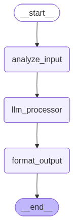
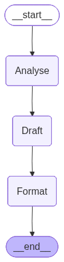

# LangGraph Sequential Workflows: A Beginner's Friendly Guide

## Welcome! 👋

If you're new to LangGraph and want to understand how to build workflows that process information step by step, you're in the right place! This guide will explain everything in simple terms, using everyday examples and analogies. No prior experience with LangGraph is needed—just a basic understanding of Python.

## What is LangGraph?

Think of LangGraph as a tool that helps you build **assembly lines for processing information**. Just like a factory assembly line where a product moves from one station to the next, getting worked on at each step, LangGraph lets you create a "workflow" where information moves through different steps, getting processed at each one.

**Why is this useful?** Instead of writing one big, complicated function that does everything, you can break your work into smaller, manageable pieces. Each piece does one job, and they all work together in order.

---

## Table of Contents

1. [What is a Sequential Workflow?](#what-is-a-sequential-workflow)
2. [The Three Main Building Blocks](#the-three-main-building-blocks)
3. [Example 1: Building a Simple Question-Answer System](#example-1-building-a-simple-question-answer-system)
4. [Example 2: Building a BMI Calculator](#example-2-building-a-bmi-calculator)
5. [Example 3: Building a Customer Support Helper](#example-3-building-a-customer-support-helper)
6. [Tips for Success](#tips-for-success)
7. [What's Next?](#whats-next)

---

## What is a Sequential Workflow?

Imagine you're making a sandwich. You don't just throw everything together at once. You follow steps:

1. **Get the bread** (Step 1)
2. **Add the filling** (Step 2)
3. **Cut it in half** (Step 3)
4. **Serve it** (Done!)

Each step uses what you did in the previous step. You can't cut the sandwich before you add the filling, right? That's exactly what a **sequential workflow** is—a series of steps that happen one after another, in order.

In LangGraph terms:
- Each step is called a **"node"** (think of it as a work station)
- The connections between steps are called **"edges"** (the path from one station to the next)
- The information that moves through is called **"state"** (like a box that carries your sandwich ingredients from step to step)

### When Should You Use Sequential Workflows?

Use sequential workflows when:
- ✅ You have multiple steps that need to happen in order
- ✅ Each step needs information from the previous step
- ✅ You want to break a big problem into smaller, easier pieces
- ✅ You want to see clearly what happens at each step

**Real-world examples:**
- Processing a customer order (validate → calculate price → send confirmation)
- Analyzing text (clean → analyze → summarize → format)
- Processing data (collect → clean → calculate → report)

---

## The Three Main Building Blocks

Before we build our first workflow, let's understand the three main pieces you'll always need:

### 1. State: The Information Container

**Think of it like:** A backpack that carries all your stuff as you move through the workflow.

The **state** is like a special box that holds all the information your workflow needs. As your information moves through each step, this box gets updated with new information.

**In simple terms:** It's a Python dictionary (a way to store information with labels) that defines what kind of information your workflow will work with.

**Example:**
```python
from typing import TypedDict

class WorkflowState(TypedDict):
    user_input: str          # The original question from the user
    cleaned_input: str       # The cleaned-up version
    llm_response: str        # The answer from the AI
    final_output: str        # The nicely formatted final answer
```

**What's TypedDict?** It's just a fancy way to tell Python "this dictionary will always have these specific fields with these types." It helps catch mistakes early and makes your code easier to understand.

**Key thing to remember:** Each step can read from the state and add new information to it. It's like passing a notebook around where each person writes something new.

### 2. Node Functions: The Workers

**Think of it like:** Individual workers at each station of the assembly line.

A **node** is just a regular Python function that:
- Takes the current state (the information box) as input
- Does some work with that information
- Returns an updated version of the state

**In simple terms:** It's a function that receives information, processes it, and gives back updated information.

**Example:**
```python
def clean_input(state: WorkflowState) -> WorkflowState:
    """This function takes the user's input and cleans it up."""
    # Get the original input from the state
    original = state["user_input"]
    
    # Clean it up (remove extra spaces, make it lowercase)
    cleaned = original.strip().lower()
    
    # Return the updated state
    return {"cleaned_input": cleaned}
```

**Important note:** You only need to return the parts of the state that you changed. LangGraph is smart—it will automatically combine your changes with the rest of the state.

**Why this is helpful:** Each function does ONE job. This makes your code:
- Easier to understand
- Easier to test
- Easier to fix if something goes wrong

### 3. Graph: The Assembly Line Setup

**Think of it like:** Drawing a map of your assembly line—showing where each station is and how they connect.

The **graph** is where you put everything together. You:
1. Create an empty graph
2. Add your nodes (the work stations)
3. Connect them with edges (show the path)
4. Compile it (make it ready to run)

**In simple terms:** You're telling LangGraph "here are my steps, and here's the order they should run in."

**Example:**
```python
from langgraph.graph import StateGraph, START, END

# Step 1: Create an empty graph
workflow = StateGraph(WorkflowState)

# Step 2: Add your nodes (the functions that do the work)
workflow.add_node("clean_input", clean_input)
workflow.add_node("process_input", process_input)
workflow.add_node("format_output", format_output)

# Step 3: Connect them in order
workflow.set_entry_point("clean_input")  # This is where we start
workflow.add_edge("clean_input", "process_input")  # After cleaning, process
workflow.add_edge("process_input", "format_output")  # After processing, format
workflow.add_edge("format_output", END)  # After formatting, we're done!

# Step 4: Compile (make it ready to use)
app = workflow.compile()
```

**What's START and END?** These are special markers that LangGraph provides:
- `START` means "beginning of the workflow"
- `END` means "end of the workflow"

---

## Example 1: Building a Simple Question-Answer System

Let's build something real! We'll create a system that:
1. Takes a user's question
2. Cleans it up
3. Sends it to an AI to get an answer
4. Formats the answer nicely

### The Problem We're Solving

You want to build a simple chatbot that answers questions. But instead of doing everything in one big function, you want to break it into clear steps so it's easier to understand and modify later.

### Step-by-Step Building

#### Step 1: Define What Information We Need (The State)

First, let's think about what information we'll need to carry through our workflow:
- The original question from the user
- A cleaned-up version of the question
- The answer from the AI
- The final formatted answer

Let's write this down:

```python
from typing import TypedDict

class WorkflowState(TypedDict):
    user_input: str          # "  What is Python?  " (original, messy)
    cleaned_input: str       # "what is python" (cleaned up)
    llm_response: str        # "Python is a programming language..." (AI's answer)
    final_output: str        # "✅ Final Answer:\n\nPython is..." (formatted)
```

**Why these fields?** Each step will add one piece of information:
- Step 1 (cleaning) will create `cleaned_input`
- Step 2 (AI processing) will create `llm_response`
- Step 3 (formatting) will create `final_output`

#### Step 2: Create the Worker Functions (The Nodes)

Now let's create three functions, one for each step:

**Function 1: Clean the Input**

This function takes the user's question and makes it nice and clean:

```python
def analyze_input(state: WorkflowState) -> WorkflowState:
    """
    This is like a worker who receives messy input and cleans it up.
    They remove extra spaces and make everything lowercase.
    """
    # Get the original input
    original_question = state["user_input"]
    
    # Clean it: remove spaces at start/end, make lowercase
    cleaned = original_question.strip().lower()
    
    # Return the cleaned version
    return {"cleaned_input": cleaned}
```

**What's happening here?**
- `state["user_input"]` gets the original question from our information box
- `.strip()` removes spaces at the beginning and end
- `.lower()` makes everything lowercase (so "Python" becomes "python")
- We return only what we changed (`cleaned_input`)

**Function 2: Get Answer from AI**

This function sends the cleaned question to an AI and gets an answer:

```python
from langchain_openai import AzureChatOpenAI

# First, set up your AI (you'll need to configure this with your API keys)
llm = get_llm()  # This is a helper function to set up your AI

def llm_processor(state: WorkflowState) -> WorkflowState:
    """
    This worker takes the cleaned question and asks the AI for an answer.
    """
    # Get the cleaned question
    question = state['cleaned_input']
    
    # Ask the AI
    response = llm.invoke(
        f"Answer the following question clearly:\n{question}"
    )
    
    # Get the text from the AI's response
    answer_text = response.content
    
    # Return the answer
    return {"llm_response": answer_text}
```

**What's happening here?**
- We get the cleaned question from the state
- We send it to the AI with a prompt (instructions for the AI)
- The AI gives us back a response
- We extract the text content and save it to the state

**Function 3: Format the Output**

This function makes the answer look nice for the user:

```python
def format_output(state: WorkflowState) -> WorkflowState:
    """
    This worker takes the AI's answer and makes it look pretty.
    """
    # Get the AI's answer
    answer = state['llm_response']
    
    # Add some nice formatting
    formatted = f"✅ Final Answer:\n\n{answer}"
    
    # Return the formatted version
    return {"final_output": formatted}
```

**What's happening here?**
- We get the AI's answer from the state
- We add a checkmark emoji and some formatting
- We return the nicely formatted version

#### Step 3: Put It All Together (Build the Graph)

Now we connect all our workers in order:

```python
from langgraph.graph import StateGraph, START, END

# Create an empty workflow
workflow = StateGraph(WorkflowState)

# Add our three workers (nodes)
workflow.add_node("analyze_input", analyze_input)
workflow.add_node("llm_processor", llm_processor)
workflow.add_node("format_output", format_output)

# Tell it where to start
workflow.set_entry_point("analyze_input")

# Connect the steps in order
workflow.add_edge("analyze_input", "llm_processor")      # After cleaning, process
workflow.add_edge("llm_processor", "format_output")       # After processing, format
workflow.add_edge("format_output", END)                   # After formatting, done!

# Make it ready to use
app = workflow.compile()
```

**Visual representation:**



#### Step 4: Use It!

Now we can actually use our workflow:

```python
# Give it a question
result = app.invoke({
    "user_input": "Explain about proton, neutron & electron in simple terms"
})

# Print the final answer
print(result["final_output"])
```

**What happens when you run this?**

1. The workflow starts with `user_input` = "Explain about proton..."
2. **Step 1 (analyze_input):** Cleans it to "explain about proton..."
3. **Step 2 (llm_processor):** Sends it to AI, gets back a detailed explanation
4. **Step 3 (format_output):** Formats it with "✅ Final Answer:"
5. You get the final formatted answer!

### What We Learned

- ✅ **Breaking things into steps makes code easier to understand**
- ✅ **Each function does one job** (clean, process, format)
- ✅ **Information flows through the state** (each step adds something new)
- ✅ **The graph shows the flow clearly** (you can see the order of operations)

---

## Example 2: Building a BMI Calculator

This example shows that LangGraph isn't just for AI! You can use it for any step-by-step process, even simple calculations.

### The Problem We're Solving

You want to calculate someone's BMI (Body Mass Index) and then tell them what category they're in (Underweight, Normal, Overweight, or Obese).

### Step-by-Step Building

#### Step 1: Define the State

What information do we need?
- The person's weight (in kilograms)
- The person's height (in meters)
- The calculated BMI
- The category (Underweight, Normal, etc.)

```python
from typing import TypedDict

class BMIState(TypedDict):
    weight_kg: float    # 69 (kilograms)
    height_m: float     # 1.77 (meters)
    bmi: float          # 22.02 (calculated)
    category: str       # "Normal" (the category)
```

#### Step 2: Create the Worker Functions

**Function 1: Calculate BMI**

This function does the math:

```python
def calculate_bmi(state: BMIState) -> BMIState:
    """
    This worker calculates BMI using the formula: weight / (height²)
    """
    # Get weight and height from the state
    weight = state['weight_kg']
    height = state['height_m']
    
    # Calculate BMI: weight divided by height squared
    bmi = weight / (height ** 2)
    
    # Return the calculated BMI
    return {"bmi": bmi}
```

**The formula:** BMI = weight ÷ (height × height)

**Example:** If someone weighs 69 kg and is 1.77 m tall:
- BMI = 69 ÷ (1.77 × 1.77)
- BMI = 69 ÷ 3.13
- BMI = 22.02

**Function 2: Categorize BMI**

This function looks at the BMI number and decides which category it falls into:

```python
def label_bmi(state: BMIState) -> BMIState:
    """
    This worker looks at the BMI number and decides the category.
    """
    # Get the calculated BMI
    bmi = state['bmi']
    
    # Decide the category based on BMI ranges
    if bmi < 18.5:
        category = "Underweight"
    elif 18.5 <= bmi < 25:
        category = "Normal"
    elif 25 <= bmi < 30:
        category = "Overweight"
    else:
        category = "Obese"
    
    # Return the category
    return {"category": category}
```

**The categories:**
- Under 18.5 = Underweight
- 18.5 to 24.9 = Normal
- 25 to 29.9 = Overweight
- 30 or above = Obese

#### Step 3: Build the Graph

```python
from langgraph.graph import StateGraph, START, END

# Create the workflow
graph = StateGraph(BMIState)

# Add our two workers
graph.add_node('calculate_bmi', calculate_bmi)
graph.add_node('label_bmi', label_bmi)

# Connect them
graph.add_edge(START, 'calculate_bmi')        # Start by calculating
graph.add_edge('calculate_bmi', 'label_bmi')  # Then categorize
graph.add_edge('label_bmi', END)              # Then we're done!

# Make it ready
workflow = graph.compile()
```

**Visual representation:**


#### Step 4: Visualize Your Workflow

LangGraph can draw a picture of your workflow! This is really helpful to see what you built:

```python
from IPython.display import Image
Image(workflow.get_graph().draw_mermaid_png())
```

This creates a visual diagram showing your nodes and how they connect. It's like a map of your assembly line!

#### Step 5: Use It!

```python
# Give it someone's weight and height
initial_state = {'weight_kg': 69, 'height_m': 1.77}

# Run the workflow
final_state = workflow.invoke(initial_state)

# See the results
print(final_state)
# Output: {'weight_kg': 69, 'height_m': 1.77, 'bmi': 22.024322512687924, 'category': 'Normal'}
```

**What happened?**
1. Started with weight=69, height=1.77
2. **Step 1:** Calculated BMI = 22.02
3. **Step 2:** Categorized it as "Normal"
4. Got back all the information!

### What We Learned

- ✅ **LangGraph works for any step-by-step process**, not just AI
- ✅ **You can do calculations and logic** in your nodes
- ✅ **Visualizing your workflow helps** you understand what you built
- ✅ **Simple workflows are easy to build** and understand

---

## Example 3: Building a Customer Support Helper

This is a more advanced example that shows how you'd build something for a real business. It uses AI to automatically handle customer support tickets.

### The Problem We're Solving

Imagine you run a business and get hundreds of customer support emails every day. You need to:
1. Figure out what category each email is (Billing, Technical, Account, etc.)
2. Decide how urgent it is (Low, Medium, High, Critical)
3. Write a draft response
4. Format everything nicely for your support team

Doing this manually takes forever! Let's automate it.

### Step-by-Step Building

#### Step 1: Define the Data Structures (Pydantic Models)

Before we start, we need to define what our data will look like. We'll use something called "Pydantic models" which are like blueprints for our data.

**What's Pydantic?** Think of it as a way to create a "form" that data must fill out. It ensures the data has the right structure and types.

```python
from pydantic import BaseModel
from typing import Literal

# This defines what information we'll get about a ticket
class TicketMeta(BaseModel):
    category: Literal["Billing", "Technical", "Account", "Feature Request"]
    priority: Literal["Low", "Medium", "High", "Critical"]
    priority_reason: str  # Why we chose this priority

# This defines what a draft response looks like
class DraftResponse(BaseModel):
    subject: str  # The email subject line
    body: str     # The email body text

# This defines the final output format
class FrontendResponse(BaseModel):
    ticket: TicketMeta
    response: DraftResponse
    status: Literal["PendingAgentReview"]  # Always pending review
```

**Why use these?** They ensure the AI gives us data in exactly the format we need. No surprises!

#### Step 2: Define the State

What information will flow through our workflow?

```python
from typing import TypedDict

class SupportTicketState(TypedDict):
    ticket_text: str        # The original customer message
    category: str          # "Billing", "Technical", etc.
    priority: str          # "Low", "Medium", "High", "Critical"
    priority_reason: str   # Why this priority
    subject: str           # Draft email subject
    body: str              # Draft email body
    frontend_payload: dict # Final formatted output
```

#### Step 3: Create the Worker Functions

**Function 1: Analyze the Ticket**

This function reads the customer's message and figures out what it's about and how urgent it is:

```python
def analyse_ticket(state: SupportTicketState) -> SupportTicketState:
    """
    This worker reads the ticket and figures out:
    - What category it is (Billing, Technical, etc.)
    - How urgent it is (Low, Medium, High, Critical)
    - Why it's that urgent
    """
    # Tell the AI we want structured output (matching our TicketMeta model)
    structured_llm = llm.with_structured_output(TicketMeta)
    
    # Send the ticket text to the AI
    result = structured_llm.invoke(state['ticket_text'])
    
    # Return the category, priority, and reason
    return {
        "category": result.category,
        "priority": result.priority,
        "priority_reason": result.priority_reason
    }
```

**What's `with_structured_output`?** This is a special feature that tells the AI "give me your answer in this exact format." Instead of getting free-form text, we get a structured object that matches our TicketMeta model.

**Function 2: Draft a Response**

This function writes a professional response email:

```python
def draft_response(state: SupportTicketState) -> SupportTicketState:
    """
    This worker writes a professional customer support response.
    It uses the category and priority to write an appropriate response.
    """
    # Create a prompt for the AI
    prompt = f"""
    Write a professional customer support response.
    
    Category: {state['category']}
    Priority: {state['priority']}
    """
    
    # Tell the AI we want a structured response (matching DraftResponse)
    structured_llm = llm.with_structured_output(DraftResponse)
    result = structured_llm.invoke(prompt)
    
    # Return the subject and body
    return {
        "subject": result.subject,
        "body": result.body
    }
```

**What's happening?** The AI writes a professional email response based on the category and priority we determined earlier.

**Function 3: Format for the Frontend**

This function puts everything together in a nice format for your support system:

```python
def format_response(state: SupportTicketState) -> SupportTicketState:
    """
    This worker puts everything together in the final format
    that your support system can use.
    """
    # Create the final structured output
    payload = FrontendResponse(
        ticket=TicketMeta(
            category=state["category"],
            priority=state["priority"],
            priority_reason=state["priority_reason"]
        ),
        response=DraftResponse(
            subject=state["subject"],
            body=state["body"]
        ),
        status="PendingAgentReview"
    )
    
    # Convert to a dictionary and return
    return {
        "frontend_payload": payload.model_dump()
    }
```

**What's `model_dump()`?** This converts the Pydantic model into a regular Python dictionary that can be easily used by other systems.

#### Step 4: Build the Graph

```python
from langgraph.graph import StateGraph, END

# Create the workflow
workflow = StateGraph(SupportTicketState)

# Add our three workers
workflow.add_node("Analyse", analyse_ticket)
workflow.add_node("Draft", draft_response)
workflow.add_node("Format", format_response)

# Set the starting point
workflow.set_entry_point("Analyse")

# Connect them in order
workflow.add_edge("Analyse", "Draft")      # After analyzing, draft response
workflow.add_edge("Draft", "Format")       # After drafting, format it
workflow.add_edge("Format", END)           # After formatting, done!

# Compile it
graph = workflow.compile()
```

**Visual representation:**



#### Step 5: Use It!

```python
# A customer support ticket
ticket = """
My payment went through twice and I still cannot access my account.
This needs to be fixed urgently.
"""

# Run the workflow
result = graph.invoke({"ticket_text": ticket})

# See the final result
print(result["frontend_payload"])
```

**What happened?**
1. **Step 1 (Analyse):** AI read the ticket and determined:
   - Category: "Billing" (it's about payment)
   - Priority: "Critical" (they can't access their account and were charged twice)
   - Reason: "Duplicate payment and account access issue"

2. **Step 2 (Draft):** AI wrote a professional response email with subject and body

3. **Step 3 (Format):** Everything was put together in a structured format ready for your support system

4. The support team can now review it and send it to the customer!

### What We Learned

- ✅ **Structured outputs ensure reliable data** (using Pydantic models)
- ✅ **Later steps can use information from earlier steps** (drafting uses the category/priority)
- ✅ **Real-world applications can be built this way** (this pattern works for production systems)
- ✅ **Breaking complex tasks into steps makes them manageable**

---

## Tips for Success

Here are some helpful tips as you build your own workflows:

### 1. Start Simple

Don't try to build everything at once! Start with a simple workflow with 2-3 steps, get it working, then add more steps.

**Good first workflow:** Clean input → Process → Format output

**Not a good first workflow:** Clean → Validate → Transform → Analyze → Generate → Format → Send → Log → Notify

### 2. Name Things Clearly

Use names that clearly describe what each step does:

✅ **Good names:**
- `clean_user_input`
- `calculate_total_price`
- `format_email_response`

❌ **Bad names:**
- `step1`
- `do_stuff`
- `process`

### 3. One Job Per Function

Each node function should do ONE thing. If you find yourself writing "and then" in your function description, you might want to split it into two functions.

✅ **Good:** One function cleans input, another processes it

❌ **Bad:** One function that cleans, processes, validates, and formats

### 4. Test Each Step

Before connecting everything together, test each function individually:

```python
# Test the cleaning function
test_state = {"user_input": "  TEST  "}
result = analyze_input(test_state)
print(result)  # Should show cleaned_input: "test"
```

### 5. Use Visualization

Always visualize your graph to make sure the connections are correct:

```python
Image(workflow.get_graph().draw_mermaid_png())
```

### 6. Handle Errors

Think about what happens if something goes wrong. What if the AI doesn't respond? What if the input is empty? Plan for these cases.

### 7. Keep State Simple

Only store what you actually need. Don't add fields "just in case"—you can always add them later if needed.

### 8. Document Your Workflow

Add comments explaining what each step does, especially if the logic is complex:

```python
def complex_calculation(state):
    """
    This function calculates the final price including:
    - Base price
    - Tax (based on location)
    - Discount (if applicable)
    - Shipping (if needed)
    """
    # ... your code here
```

---

## What's Next?

Congratulations! You now understand the basics of sequential workflows in LangGraph. In our next blog post, we'll dive deeper into more advanced LangGraph features. Here's what's coming up:

### 1. Conditional Workflows

Instead of always going step-by-step in the same order, you can make decisions:

```
[Analyze] → Is it urgent? 
              ├─ Yes → [Escalate]
              └─ No → [Normal Process]
```

### 2. Loops

Sometimes you need to repeat steps until a condition is met (like refining an answer until it's good enough).

### 3. Human-in-the-Loop

You can pause workflows to ask a human for input, then continue.

### 4. Parallel Processing

Some steps can run at the same time if they don't depend on each other.

### 5. Error Handling and Retries

Learn how to handle errors gracefully and retry failed steps.

**Stay tuned for our next blog post where we'll cover all these advanced topics in detail with practical examples!**

---

## Common Questions

### Q: Do I need to know a lot of Python to use LangGraph?

**A:** Basic Python knowledge is helpful, but you don't need to be an expert. If you can write functions and use dictionaries, you're good to go!

### Q: Can I use LangGraph without AI?

**A:** Absolutely! Example 2 (BMI Calculator) shows you can use LangGraph for any step-by-step process, not just AI workflows.

### Q: How do I debug my workflow?

**A:** Start by testing each node function individually. Then test the full workflow with simple inputs. Use print statements to see what's in the state at each step.

### Q: Can I change the order of steps?

**A:** Yes! Just change the edges. The graph structure is flexible—you can rearrange steps, add new ones, or remove old ones.

### Q: What if a step fails?

**A:** LangGraph has error handling features. For now, make sure your functions handle edge cases (empty inputs, invalid data, etc.).

---

## Conclusion

You've learned how to build sequential workflows with LangGraph! Remember:

1. **State** = The information container that moves through your workflow
2. **Nodes** = The worker functions that process information
3. **Graph** = The assembly line that connects everything together

The three examples we covered show:
- **Simple workflows** (Question-Answer system)
- **Calculation workflows** (BMI Calculator)
- **Real-world applications** (Customer Support system)

Start with something simple, get it working, then gradually add complexity. Before you know it, you'll be building sophisticated workflows!

---

## Additional Resources

Want to learn more? Check out these resources:

- **Official LangGraph Documentation:** [langchain-ai.github.io/langgraph/](https://langchain-ai.github.io/langgraph/)
- **LangGraph GitHub:** [github.com/langchain-ai/langgraph](https://github.com/langchain-ai/langgraph)
- **Python Basics:** If you need to brush up on Python, check out Python.org's tutorial

---

## Final Thoughts

Building workflows might seem complicated at first, but remember: you're just connecting simple functions together in a logical order. Each function does one thing, and together they solve bigger problems.

Think of it like cooking: you don't need to know everything about cooking to make a sandwich. You just need to know the steps: get bread, add filling, cut, serve. LangGraph workflows are the same—break your problem into steps, and connect them together.

**Happy building!** 🚀

If you have questions or get stuck, remember:
- Start simple
- Test each step
- Visualize your workflow
- Don't be afraid to experiment!

Good luck with your LangGraph journey!
